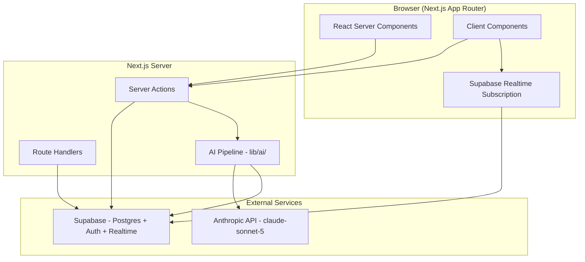
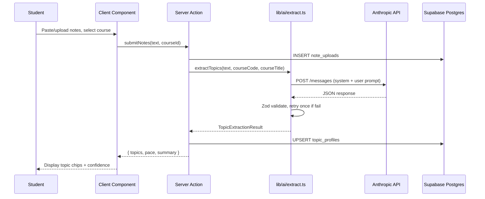
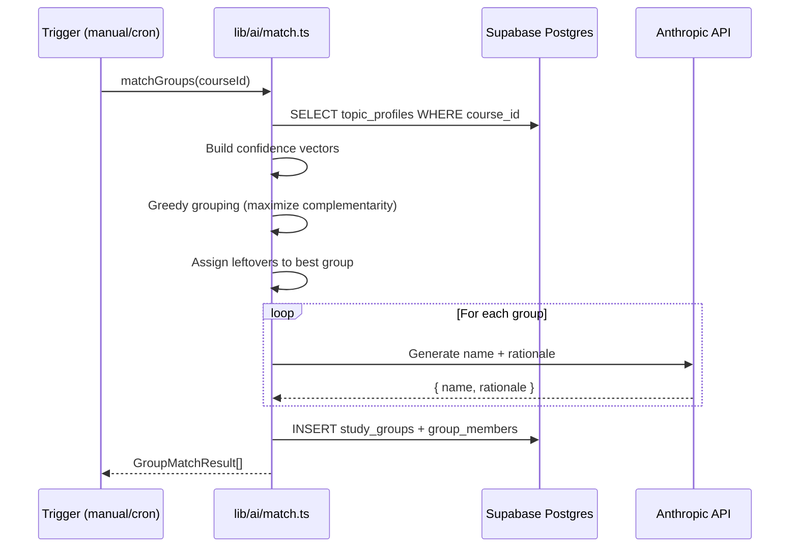
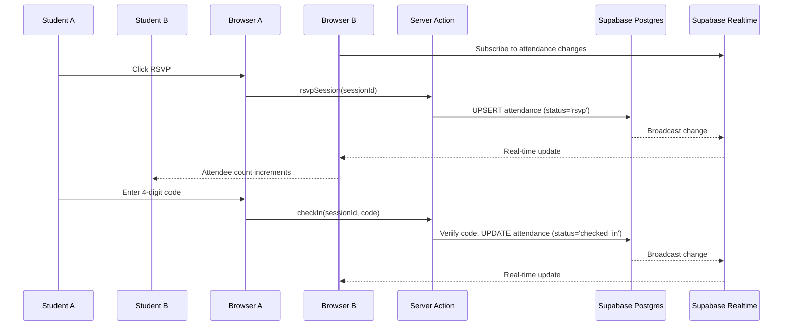

# Design Document: StudyHall UBC

## Overview

StudyHall UBC is a web application where verified UBC students upload course notes, an AI pipeline extracts topic confidence profiles, students are matched into complementary study groups of 4-6 members (strong where others are weak), and each group receives AI-generated study session timelines with campus room assignments, RSVP, and check-in functionality.

The system is built on Next.js 15+ App Router with TypeScript, Supabase (Postgres + Auth + Realtime), Tailwind CSS + shadcn/ui, and Anthropic's Claude API for AI calls. The core differentiator is the complementarity-based matching algorithm — groups are formed so that members have differing weak topics rather than identical gaps.

The application supports unauthenticated browsing of subjects and courses, but requires @student.ubc.ca email OTP authentication for uploads, group membership, RSVP, and check-in.

## Architecture



## Sequence Diagrams

### Note Upload & Topic Extraction



### Group Matching



### RSVP & Check-in with Realtime



## Components and Interfaces

### Component 1: Authentication Layer

**Purpose**: Restrict access to verified UBC students using email OTP, enforce @student.ubc.ca domain at client and database levels.

```typescript
// lib/auth/validate.ts
interface AuthConfig {
  allowedDomain: string; // "student.ubc.ca"
}

function validateUBCEmail(email: string): boolean;
function requireAuth(): Promise<User>;
function requireOnboarded(): Promise<Profile>;
```

**Responsibilities**:
- Validate email domain before sending OTP
- Enforce domain at DB level via trigger
- Manage session via `@supabase/ssr` cookie-based auth
- Redirect unonboarded users to `/onboarding`

### Component 2: AI Pipeline

**Purpose**: Server-side only AI calls to Anthropic for topic extraction, group naming, and timeline generation.

```typescript
// lib/ai/extract.ts
interface TopicExtraction {
  topics: Array<{
    topic: string;
    confidence: number; // 1-5
    status: "learning" | "reviewing" | "stuck";
  }>;
  overall_pace: "behind" | "on_track" | "ahead";
  summary: string;
}

async function extractTopics(
  rawText: string,
  courseCode: string,
  courseTitle: string
): Promise<TopicExtraction>;

// lib/ai/match.ts
interface GroupMatchResult {
  members: string[]; // user IDs
  name: string;
  rationale: string;
  score: number;
}

function computeComplementarityScore(
  members: TopicProfile[]
): number;

async function matchGroups(
  courseId: string
): Promise<GroupMatchResult[]>;

// lib/ai/timeline.ts
interface SessionPlan {
  date: string; // ISO date
  start_time: string; // HH:MM
  end_time: string; // HH:MM
  topic: string;
  goal: string;
}

interface TimelineResult {
  sessions: SessionPlan[];
}

async function generateTimeline(
  groupProfiles: TopicProfile[],
  courseCode: string,
  today: Date,
  examDate: Date
): Promise<TimelineResult>;
```

**Responsibilities**:
- Never expose API keys to client
- Validate all LLM responses with Zod
- Retry once on parse failure
- Return typed, validated results

### Component 3: Group Matching Algorithm

**Purpose**: Core matching logic that forms groups of 4-6 students maximizing complementarity.

```typescript
// lib/ai/match.ts (pure functions)
interface TopicVector {
  userId: string;
  topics: Record<string, number>; // topic -> confidence (1-5)
  pace: "behind" | "on_track" | "ahead";
}

function buildTopicVectors(
  profiles: TopicProfile[]
): TopicVector[];

function computeComplementarityScore(
  group: TopicVector[]
): number;

function greedyGroupFormation(
  vectors: TopicVector[],
  minSize: number, // 4
  maxSize: number  // 6
): TopicVector[][];

function assignLeftovers(
  groups: TopicVector[][],
  leftovers: TopicVector[],
  maxSize: number
): TopicVector[][];
```

**Responsibilities**:
- Pure function scoring (no side effects, unit testable)
- Maximize complementarity: sum over topics of (max_confidence - min_confidence)
- Penalize pace differences > 1 step
- Handle edge cases (< 4 users, odd numbers)

### Component 4: Supabase Data Layer

**Purpose**: Database access, RLS enforcement, and realtime subscriptions.

```typescript
// lib/supabase/server.ts
function createServerClient(): SupabaseClient;

// lib/supabase/client.ts
function createBrowserClient(): SupabaseClient;

// lib/supabase/middleware.ts
function updateSession(request: NextRequest): NextResponse;
```

**Responsibilities**:
- Server-side client for Server Components and Server Actions
- Browser client for realtime subscriptions
- Middleware for session refresh
- RLS policies enforce all access control

### Component 5: Realtime Attendance

**Purpose**: Live updates of RSVP counts and check-in status across browsers.

```typescript
// hooks/use-attendance.ts
interface AttendanceState {
  rsvpCount: number;
  checkedInCount: number;
  attendees: Attendee[];
}

function useAttendance(sessionId: string): AttendanceState;
```

**Responsibilities**:
- Subscribe to `attendance` table changes filtered by session_id
- Update UI immediately on INSERT/UPDATE
- Clean up subscription on unmount

## Data Models

### TopicProfile

```typescript
interface TopicProfile {
  id: string;
  userId: string;
  courseId: string;
  topics: Array<{
    topic: string;
    confidence: number; // 1-5
    status: "learning" | "reviewing" | "stuck";
  }>;
  overallPace: "behind" | "on_track" | "ahead";
  summary: string;
  updatedAt: Date;
}
```

**Validation Rules**:
- confidence must be integer 1-5
- status must be one of the three allowed values
- topics array must have at least 1 item
- overallPace must be one of three allowed values

### StudyGroup

```typescript
interface StudyGroup {
  id: string;
  courseId: string;
  name: string; // AI-generated, 2-3 words
  rationale: string;
  members: GroupMember[];
  createdAt: Date;
}

interface GroupMember {
  userId: string;
  displayName: string;
  topicProfile: TopicProfile;
}
```

**Validation Rules**:
- Group must have 4-6 members
- All members must be enrolled in the same course
- Name must be 2-3 words

### Session

```typescript
interface Session {
  id: string;
  groupId: string;
  roomId: string;
  date: string; // ISO date
  startTime: string; // HH:MM
  endTime: string; // HH:MM
  topic: string;
  goal: string;
  status: "scheduled" | "cancelled" | "completed";
  checkinCode: string; // 4 digits
  createdAt: Date;
}
```

**Validation Rules**:
- checkinCode must be exactly 4 digits
- startTime must be between 09:00 and 20:00
- endTime - startTime must be 90 minutes
- date must be a weekday
- status transitions: scheduled -> cancelled | completed

### Attendance

```typescript
interface Attendance {
  id: string;
  sessionId: string;
  userId: string;
  status: "rsvp" | "checked_in" | "no_show";
  rsvpAt: Date | null;
  checkedInAt: Date | null;
}
```

**Validation Rules**:
- Unique constraint on (sessionId, userId)
- Status transitions: rsvp -> checked_in | no_show
- checkedInAt only set when status = "checked_in"

## Algorithmic Pseudocode

### Complementarity Scoring Algorithm

```typescript
/**
 * ALGORITHM: computeComplementarityScore
 * INPUT: group: TopicVector[] (4-6 members with topic->confidence maps)
 * OUTPUT: number (higher = more complementary)
 *
 * PRECONDITIONS:
 * - group.length >= 2
 * - All members share at least one common topic
 * - confidence values are integers 1-5
 *
 * POSTCONDITIONS:
 * - Returns non-negative number
 * - Score increases with topic confidence diversity within group
 * - Score decreases with pace misalignment
 *
 * LOOP INVARIANTS:
 * - complementaritySum accumulates valid per-topic spread values
 */
function computeComplementarityScore(group: TopicVector[]): number {
  // Collect all unique topics across group members
  const allTopics = new Set<string>();
  for (const member of group) {
    for (const topic of Object.keys(member.topics)) {
      allTopics.add(topic);
    }
  }

  // For each topic, compute spread (max - min confidence)
  let complementaritySum = 0;
  for (const topic of allTopics) {
    const confidences = group
      .map(m => m.topics[topic] ?? 0)
      .filter(c => c > 0); // only members who have this topic

    if (confidences.length >= 2) {
      const spread = Math.max(...confidences) - Math.min(...confidences);
      complementaritySum += spread;
    }
  }

  // Penalize pace differences > 1 step
  const paceValues = { behind: 0, on_track: 1, ahead: 2 };
  const paces = group.map(m => paceValues[m.pace]);
  const paceSpread = Math.max(...paces) - Math.min(...paces);
  const pacePenalty = paceSpread > 1 ? paceSpread * 2 : 0;

  return complementaritySum - pacePenalty;
}
```

### Greedy Group Formation Algorithm

```typescript
/**
 * ALGORITHM: greedyGroupFormation
 * INPUT: vectors: TopicVector[], minSize: 4, maxSize: 6
 * OUTPUT: TopicVector[][] (array of groups)
 *
 * PRECONDITIONS:
 * - vectors.length >= minSize (at least one group can form)
 * - minSize <= maxSize
 *
 * POSTCONDITIONS:
 * - Each group has minSize to maxSize members
 * - Every input vector appears in exactly one group
 * - Groups are formed to maximize complementarity score
 *
 * LOOP INVARIANTS:
 * - remaining + sum(group.length for formed groups) = vectors.length
 * - All formed groups have >= minSize members
 */
function greedyGroupFormation(
  vectors: TopicVector[],
  minSize: number = 4,
  maxSize: number = 6
): TopicVector[][] {
  const remaining = [...vectors];
  const groups: TopicVector[][] = [];

  while (remaining.length >= minSize) {
    // Start with the user who has the most extreme topic profile
    const seed = remaining.shift()!;
    const group: TopicVector[] = [seed];

    // Greedily add members that maximize complementarity
    while (group.length < maxSize && remaining.length > 0) {
      let bestIdx = -1;
      let bestScore = -Infinity;

      for (let i = 0; i < remaining.length; i++) {
        const candidate = [...group, remaining[i]];
        const score = computeComplementarityScore(candidate);
        if (score > bestScore) {
          bestScore = score;
          bestIdx = i;
        }
      }

      // Stop if we have minimum size and adding more doesn't help
      if (group.length >= minSize && bestScore <= computeComplementarityScore(group)) {
        break;
      }

      group.push(remaining.splice(bestIdx, 1)[0]);
    }

    if (group.length >= minSize) {
      groups.push(group);
    } else {
      // Put members back if group too small
      remaining.push(...group);
      break;
    }
  }

  // Assign leftovers to highest-scoring group
  if (remaining.length > 0) {
    assignLeftovers(groups, remaining, maxSize);
  }

  return groups;
}
```

### Timeline Generation Logic

```typescript
/**
 * ALGORITHM: generateTimeline
 * INPUT: groupProfiles, courseCode, today, examDate
 * OUTPUT: TimelineResult with 6 weekday sessions
 *
 * PRECONDITIONS:
 * - groupProfiles.length >= 1
 * - examDate > today
 * - At least 6 weekdays exist between today and examDate
 *
 * POSTCONDITIONS:
 * - Exactly 6 sessions returned
 * - All sessions fall on weekdays
 * - All sessions between 09:00 and 20:00
 * - All sessions are 90 minutes
 * - Topics ordered weakest-first
 * - Rooms assigned by round-robin
 */
async function generateTimeline(
  groupProfiles: TopicProfile[],
  courseCode: string,
  today: Date,
  examDate: Date
): Promise<TimelineResult> {
  // Aggregate weak topics across group
  // Call Anthropic to generate optimized session plan
  // Validate with Zod
  // Assign rooms by round-robin from available rooms
  // Return validated timeline
}
```

## Key Functions with Formal Specifications

### Function: validateUBCEmail

```typescript
function validateUBCEmail(email: string): boolean
```

**Preconditions:**
- `email` is a non-empty string

**Postconditions:**
- Returns `true` if and only if email ends with `@student.ubc.ca`
- Case-insensitive comparison on domain
- No side effects

### Function: computeComplementarityScore

```typescript
function computeComplementarityScore(group: TopicVector[]): number
```

**Preconditions:**
- `group.length >= 2`
- Each member has at least one topic with confidence 1-5
- All confidence values are integers in [1, 5]

**Postconditions:**
- Returns a number (can be negative if pace penalty dominates)
- Higher score indicates more complementary group
- Score = sum(per-topic spread) - pacePenalty
- Pure function with no side effects

**Loop Invariants:**
- `complementaritySum` is non-negative after each topic iteration
- Only topics with >= 2 members contribute to score

### Function: greedyGroupFormation

```typescript
function greedyGroupFormation(vectors: TopicVector[], minSize: number, maxSize: number): TopicVector[][]
```

**Preconditions:**
- `vectors.length >= minSize`
- `4 <= minSize <= maxSize <= 6`
- Each vector has a valid pace and at least one topic

**Postconditions:**
- Every input vector appears in exactly one output group
- Each group has between `minSize` and `maxSize` members (inclusive)
- No vector is lost or duplicated
- Groups are locally optimal (greedy) for complementarity

**Loop Invariants:**
- `remaining.length + sum(group sizes) = vectors.length` at all times
- All completed groups have `>= minSize` members

### Function: extractTopics

```typescript
async function extractTopics(rawText: string, courseCode: string, courseTitle: string): Promise<TopicExtraction>
```

**Preconditions:**
- `rawText` is non-empty
- `courseCode` and `courseTitle` are non-empty strings
- ANTHROPIC_API_KEY is set in environment

**Postconditions:**
- Returns Zod-validated TopicExtraction object
- topics array has >= 1 item
- Each confidence is integer 1-5
- Each status is one of "learning" | "reviewing" | "stuck"
- Retries once on Zod validation failure

## Example Usage

```typescript
// Example 1: Topic Extraction
const result = await extractTopics(
  "Binary search trees allow O(log n) lookup...",
  "CPSC 221",
  "Basic Algorithms and Data Structures"
);
// result = {
//   topics: [
//     { topic: "Binary Search Trees", confidence: 4, status: "reviewing" },
//     { topic: "Time Complexity", confidence: 3, status: "learning" }
//   ],
//   overall_pace: "on_track",
//   summary: "Student demonstrates solid understanding of BSTs but is still developing complexity analysis skills."
// }

// Example 2: Complementarity Scoring
const score = computeComplementarityScore([
  { userId: "a", topics: { "BST": 5, "Graphs": 2 }, pace: "on_track" },
  { userId: "b", topics: { "BST": 2, "Graphs": 5 }, pace: "on_track" },
]);
// score = (5-2) + (5-2) = 6 (high complementarity!)

// Example 3: Low complementarity (everyone stuck on same thing)
const badScore = computeComplementarityScore([
  { userId: "a", topics: { "BST": 2, "Graphs": 2 }, pace: "behind" },
  { userId: "b", topics: { "BST": 2, "Graphs": 2 }, pace: "behind" },
]);
// score = (2-2) + (2-2) = 0 (no complementarity)

// Example 4: RSVP with realtime
const { rsvpCount, attendees } = useAttendance(sessionId);
// Updates in real-time across all connected browsers

// Example 5: Email validation
validateUBCEmail("student@student.ubc.ca"); // true
validateUBCEmail("person@gmail.com");        // false
```

## Error Handling

### Error Scenario 1: AI Parse Failure

**Condition**: Anthropic returns malformed JSON that fails Zod validation
**Response**: Retry the API call once with the same prompt
**Recovery**: If second attempt fails, throw a typed error. UI shows error toast "Unable to process notes, please try again."

### Error Scenario 2: Invalid Email Domain

**Condition**: User attempts to sign up with non-@student.ubc.ca email
**Response**: Client-side: show validation error before sending OTP. DB-side: Postgres trigger raises exception, Supabase returns error.
**Recovery**: User is prompted to use their UBC student email.

### Error Scenario 3: Group Too Small

**Condition**: Fewer than 4 students enrolled in a course have topic profiles
**Response**: Do not form a group. Return empty result.
**Recovery**: Students are notified that more classmates need to upload notes before matching can occur.

### Error Scenario 4: Invalid Check-in Code

**Condition**: User enters wrong 4-digit code
**Response**: Return validation error, do not update attendance status
**Recovery**: User can retry. No rate limiting for MVP.

### Error Scenario 5: Realtime Connection Lost

**Condition**: WebSocket disconnects (network issues)
**Response**: Supabase client auto-reconnects
**Recovery**: On reconnect, refetch current attendance state to ensure consistency.

## Testing Strategy

### Unit Testing Approach

- Test `computeComplementarityScore` with various group compositions
- Test `greedyGroupFormation` for correctness invariants
- Test `validateUBCEmail` for various email formats
- Test Zod schemas for edge cases
- Test timeline date/time constraints
- Framework: Vitest

### Property-Based Testing Approach

- Use `fast-check` library for property-based tests
- Test that group formation never loses or duplicates users
- Test that complementarity score increases with diversity
- Test that timeline always produces valid weekday sessions
- Minimum 100 iterations per property

### Integration Testing Approach

- Test AI pipeline with mocked Anthropic responses
- Test Supabase RLS policies with different user roles
- Test realtime subscriptions with multiple clients
- Test auth flow end-to-end with email OTP

## Performance Considerations

- AI calls are server-side only, preventing client bundle bloat
- Topic extraction should complete within 10 seconds
- Group matching algorithm is O(n^2 * k) where n=users, k=topics — acceptable for class sizes < 500
- Realtime subscriptions filtered by session_id to minimize broadcast overhead
- React Server Components minimize client JS for read-heavy pages (subjects, courses)

## Security Considerations

- ANTHROPIC_API_KEY and SUPABASE_SERVICE_ROLE_KEY never exposed to client
- RLS policies enforce all data access at database layer
- Email domain enforced at client AND database trigger (defense in depth)
- Check-in codes are 4-digit random, generated server-side
- No user PII exposed to unauthenticated users (attendee names require auth)

## Dependencies

- `next` 15+ (App Router, Server Actions, RSC)
- `react` 19+
- `@supabase/supabase-js` + `@supabase/ssr` (auth, data, realtime)
- `@anthropic-ai/sdk` (AI calls)
- `zod` (schema validation)
- `tailwindcss` + `shadcn/ui` (styling)
- `fast-check` (property-based testing, dev)
- `vitest` (test runner, dev)

## Correctness Properties

*A property is a characteristic or behavior that should hold true across all valid executions of a system — essentially, a formal statement about what the system should do. Properties serve as the bridge between human-readable specifications and machine-verifiable correctness guarantees.*

### Property 1: Email domain validation

*For any* string, the email validation function must return true if and only if the string ends with `@student.ubc.ca` (case-insensitive on domain). All other strings must return false.

**Validates: Requirements 1.1, 1.2**

### Property 2: Group member conservation

*For any* set of input topic vectors with at least 4 members, after group formation, the total number of users across all groups must equal the number of input vectors — no user is lost or duplicated, and no user appears in more than one group.

**Validates: Requirements 5.5, 5.7**

### Property 3: Group size bounds

*For any* set of input topic vectors with at least 4 members, every resulting group must have between 4 and 6 members (inclusive). For any input with fewer than 4 vectors, the result must be empty.

**Validates: Requirements 5.1, 5.4**

### Property 4: Complementarity score correctness

*For any* group of topic vectors, the complementarity score must equal the sum of (max confidence - min confidence) for each shared topic, minus the pace penalty. A group where all members have identical confidence vectors must score 0.

**Validates: Requirements 5.2**

### Property 5: Pace penalty monotonicity

*For any* two groups with identical topic spreads, the group with pace spread > 1 must have a strictly lower complementarity score than the group with pace spread <= 1.

**Validates: Requirements 5.3**

### Property 6: Timeline validity

*For any* generated timeline, it must contain exactly 6 sessions, all on weekdays (Monday-Friday), with start times >= 09:00, end times <= 20:00, and each session lasting exactly 90 minutes.

**Validates: Requirements 6.1, 6.2, 6.3**

### Property 7: Timeline topic ordering

*For any* generated timeline given a set of group topic profiles, the sessions must be ordered with weakest aggregate topics scheduled first and strongest last.

**Validates: Requirements 6.4**

### Property 8: Room round-robin distribution

*For any* set of sessions and available rooms, rooms must be assigned in round-robin order such that no room is assigned more than ceil(sessions/rooms) times and the distribution differs by at most 1 across rooms.

**Validates: Requirements 6.5**

### Property 9: Check-in code format and uniqueness

*For any* generated session, the check-in code must be exactly 4 characters, all numeric digits. For any timeline of sessions, all check-in codes within that timeline must be distinct.

**Validates: Requirements 6.6**

### Property 10: Wrong check-in code rejection

*For any* session with check-in code C and any input code that does not equal C, the check-in attempt must be rejected.

**Validates: Requirements 7.3**

### Property 11: AI response schema validation

*For any* topic extraction result that passes Zod validation, every topic must have confidence as an integer in [1,5] and status as one of "learning", "reviewing", or "stuck". Any response not conforming must be rejected by the schema.

**Validates: Requirements 4.2, 10.3**

### Property 12: Seed idempotence

*For any* database state after seeding, running the seed operation again must produce the same state — no duplicate records and no errors.

**Validates: Requirements 11.3**

### Property 13: Subject pinning for enrolled students

*For any* authenticated student with course enrollments, when viewing the subjects page, the student's enrolled subjects must appear before all non-enrolled subjects in the display order.

**Validates: Requirements 3.3**
