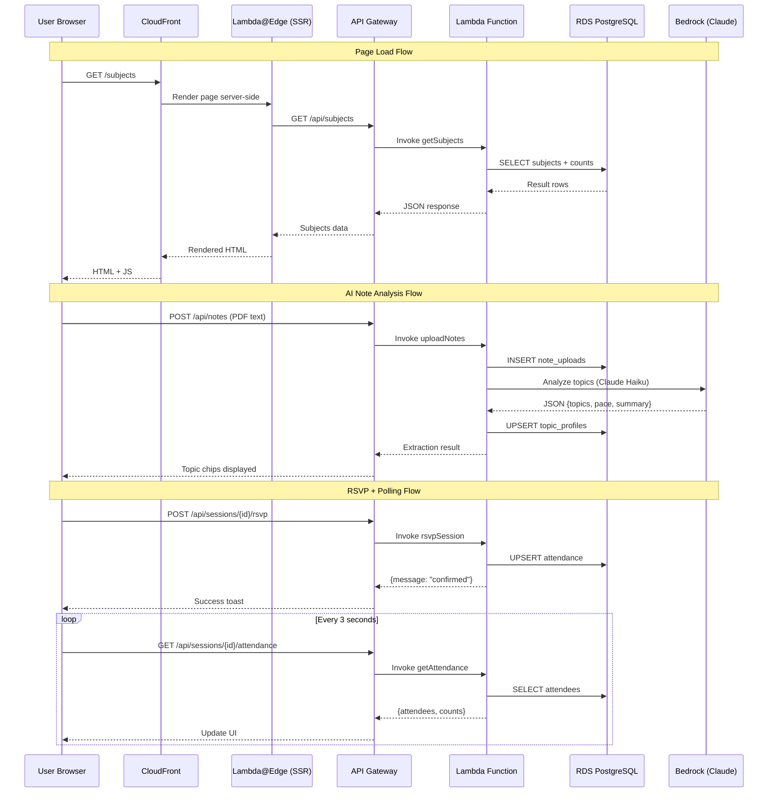
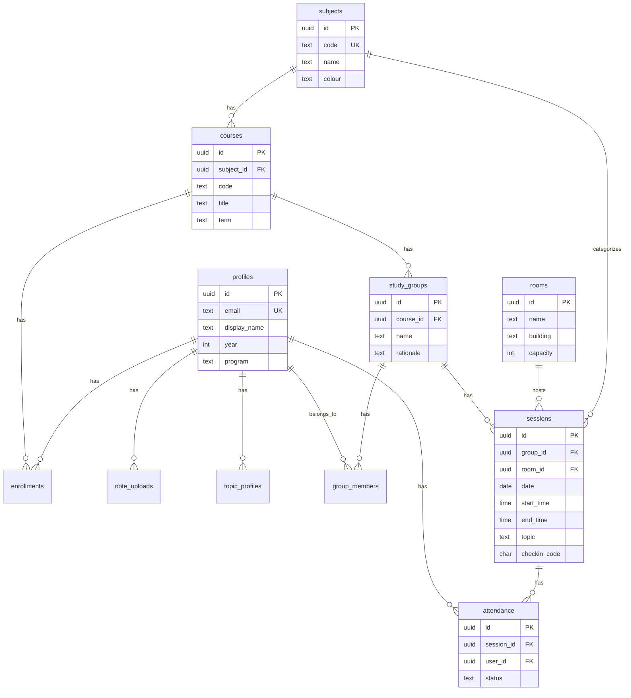
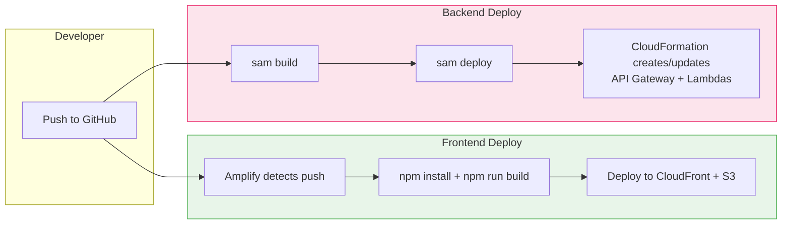

# StudyHall UBC — AWS Architecture

## System Architecture Diagram

```mermaid
graph TB
    subgraph Users["👤 Users (Browser)"]
        Browser[Web Browser]
    end

    subgraph AWS["☁️ AWS Cloud (us-east-1)"]
        subgraph Amplify["AWS Amplify Hosting"]
            CF[Amazon CloudFront<br/>CDN + HTTPS]
            S3[Amazon S3<br/>Static Assets]
            SSR[Lambda@Edge<br/>Server-Side Rendering]
        end

        subgraph API["API Layer"]
            APIGW[Amazon API Gateway<br/>REST API · CORS: *]
        end

        subgraph Compute["Compute Layer"]
            L1[Lambda: getSubjects]
            L2[Lambda: getSubjectDetail]
            L3[Lambda: getSessions]
            L4[Lambda: getSessionDetail]
            L5[Lambda: getAttendance]
            L6[Lambda: rsvpSession]
            L7[Lambda: checkIn]
            L8[Lambda: uploadNotes]
            L9[Lambda: getGroup]
            L10[Lambda: matchGroups]
            L11[Lambda: seedDatabase]
        end

        subgraph Data["Data Layer"]
            RDS[(Amazon RDS<br/>PostgreSQL 15<br/>db.t3.micro)]
        end

        subgraph AI["AI Layer"]
            Bedrock[Amazon Bedrock<br/>Claude 3.5 Haiku]
        end

        subgraph Security["Security"]
            IAM[AWS IAM<br/>Lambda Execution Role]
        end
    end

    Browser -->|HTTPS| CF
    CF -->|Static files| S3
    CF -->|Dynamic pages| SSR
    Browser -->|API calls| APIGW
    
    APIGW --> L1
    APIGW --> L2
    APIGW --> L3
    APIGW --> L4
    APIGW --> L5
    APIGW --> L6
    APIGW --> L7
    APIGW --> L8
    APIGW --> L9
    APIGW --> L10
    APIGW --> L11

    L1 --> RDS
    L2 --> RDS
    L3 --> RDS
    L4 --> RDS
    L5 --> RDS
    L6 --> RDS
    L7 --> RDS
    L8 --> RDS
    L8 --> Bedrock
    L9 --> RDS
    L10 --> RDS
    L10 --> Bedrock
    L11 --> RDS

    IAM -.->|Permissions| L1
    IAM -.->|Permissions| L8
    IAM -.->|Permissions| L10

    style AWS fill:#f0f4ff,stroke:#2563eb
    style Amplify fill:#e8f5e9,stroke:#4caf50
    style API fill:#fff3e0,stroke:#ff9800
    style Compute fill:#fce4ec,stroke:#e91e63
    style Data fill:#e3f2fd,stroke:#2196f3
    style AI fill:#f3e5f5,stroke:#9c27b0
    style Security fill:#fff8e1,stroke:#ffc107
```

## Request Flow



## Database Schema



## AWS Services Used

| Service | Purpose | Free Tier |
|---------|---------|-----------|
| **Amplify Hosting** | Next.js frontend with SSR, CI/CD from GitHub | 1000 build min/mo, 15 GB served |
| **CloudFront** | Global CDN, HTTPS, edge caching | 1 TB transfer/mo |
| **S3** | Static asset storage (JS, CSS, images) | 5 GB storage |
| **API Gateway** | REST API routing, CORS, request validation | 1M calls/mo |
| **Lambda** | Serverless compute (Node.js 20, 11 functions) | 1M invocations/mo |
| **RDS PostgreSQL** | Relational database (11 tables) | 750 hrs db.t3.micro/mo |
| **Bedrock** | AI inference (Claude 3.5 Haiku) | Pay per token (~$0.001/req) |
| **IAM** | Permissions and service roles | Free |

## Deployment Pipeline


